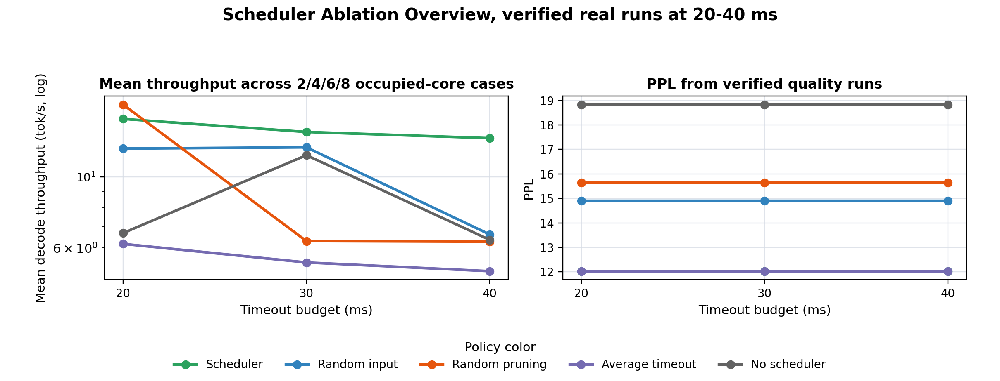
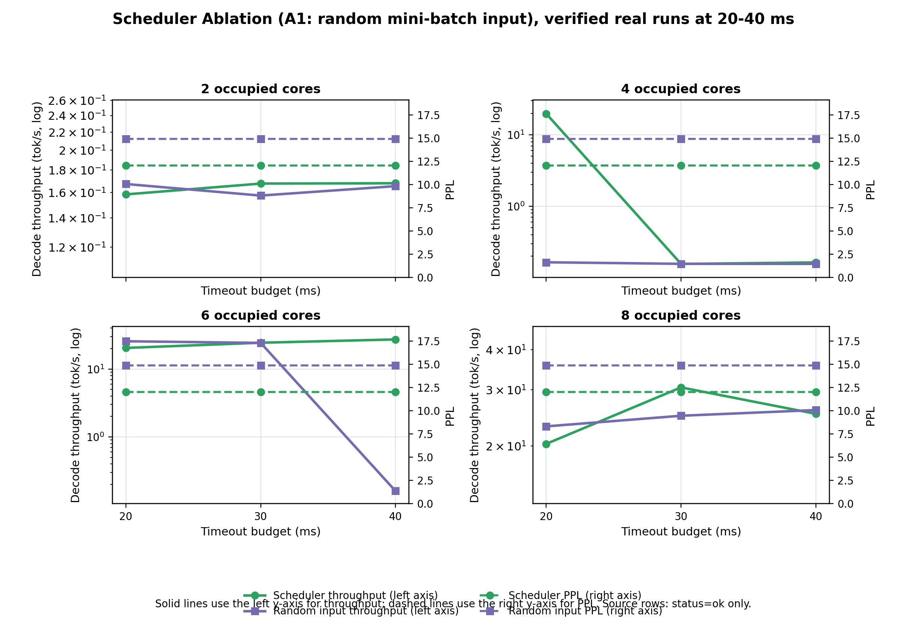
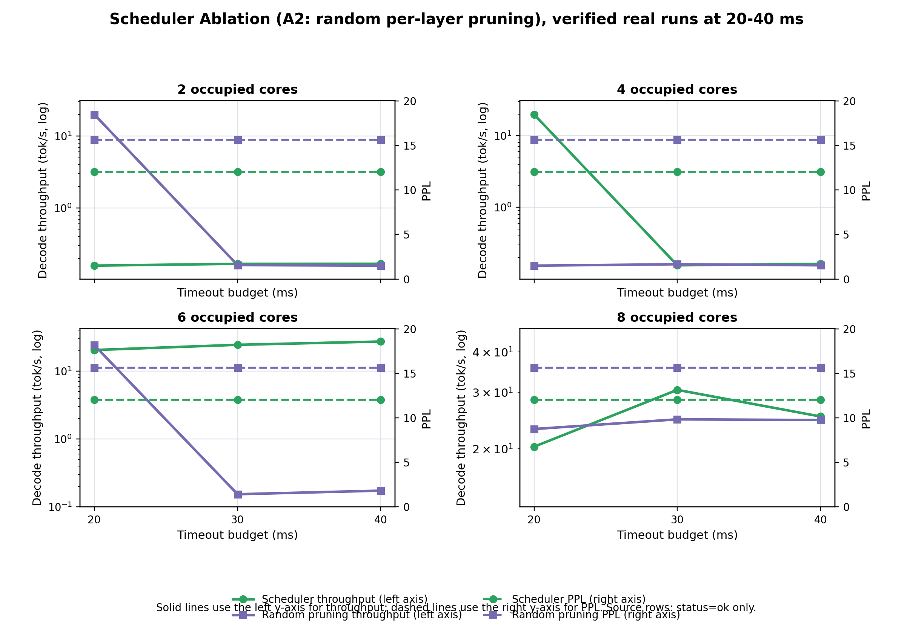
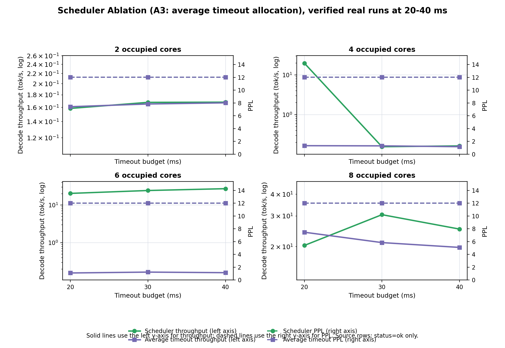
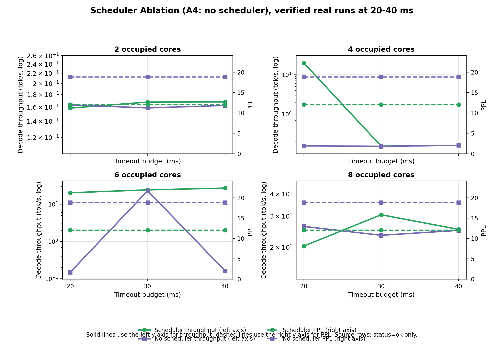

# Scheduler Ablation Plots: Real 20-40 ms Data

本报告只使用主 CSV 中已经闭环验证过的真实运行数据：timeout 为 `20/30/40 ms`，且所有使用行均满足 `status=ok`。

未使用任何 `*.before_*` 备份文件，也未使用被外部 `monotonic_load_6occ_config1` 负载污染风险影响的 `50ms+` 中间数据。

## Data Files

- Long table: `ablation_real_20_40_long.csv`
- Summary table: `ablation_real_20_40_summary.csv`
- Source PPL CSV: `ppl_raw.csv`
- Source decode CSV: `decode_raw.csv`

## Figures

### Overview

- PNG: `figures/scheduler_ablation_overview_real_20_40.png`
- PDF: `figures/scheduler_ablation_overview_real_20_40.pdf`

### A1: random mini-batch input

- PNG: `figures/A1_random_input_real_20_40.png`
- PDF: `figures/A1_random_input_real_20_40.pdf`

### A2: random per-layer pruning

- PNG: `figures/A2_random_pruning_real_20_40.png`
- PDF: `figures/A2_random_pruning_real_20_40.pdf`

### A3: average timeout allocation

- PNG: `figures/A3_average_timeout_real_20_40.png`
- PDF: `figures/A3_average_timeout_real_20_40.pdf`

### A4: no scheduler

- PNG: `figures/A4_no_scheduler_real_20_40.png`
- PDF: `figures/A4_no_scheduler_real_20_40.pdf`

## Plot Semantics

### Per-ablation 2x2 figures

- Solid green line: scheduler decode throughput, read from the left y-axis.
- Solid purple line: ablation decode throughput, read from the left y-axis.
- Dashed green line: scheduler PPL, read from the right y-axis.
- Dashed purple line: ablation PPL, read from the right y-axis.
- Marker shape also separates scheduler (`o`) from ablation (`s`).

### Overview figure

- The left subplot contains mean throughput across the four occupied-core cases.
- The right subplot contains PPL.
- The overview legend maps color to policy only; line style is not used to distinguish throughput from PPL in this figure.

Throughput y-axes use log scale because the real runs include low-throughput tail-wait cases around `0.15 tok/s` and normal cases around `20+ tok/s`.

## Ablation Definitions

- `A1_random_input`: A1: random mini-batch input; random mini-batch input, DP pruning and weighted timeout kept.
- `A2_random_pruning`: A2: random per-layer pruning; constructed mini-batch input, randomized per-layer pruning, weighted timeout kept.
- `A3_average_timeout`: A3: average timeout allocation; constructed mini-batch input and DP pruning kept, timeout evenly allocated.
- `A4_no_scheduler`: A4: no scheduler; random input, random pruning, and average timeout allocation.
